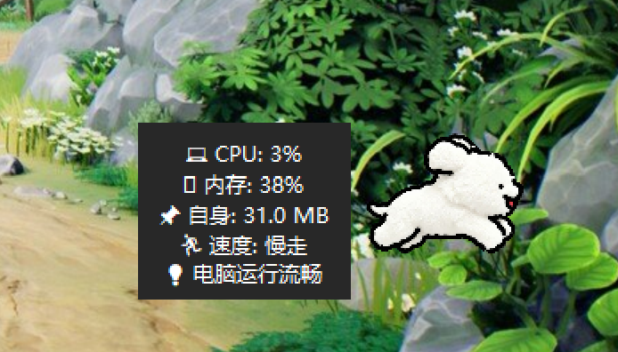
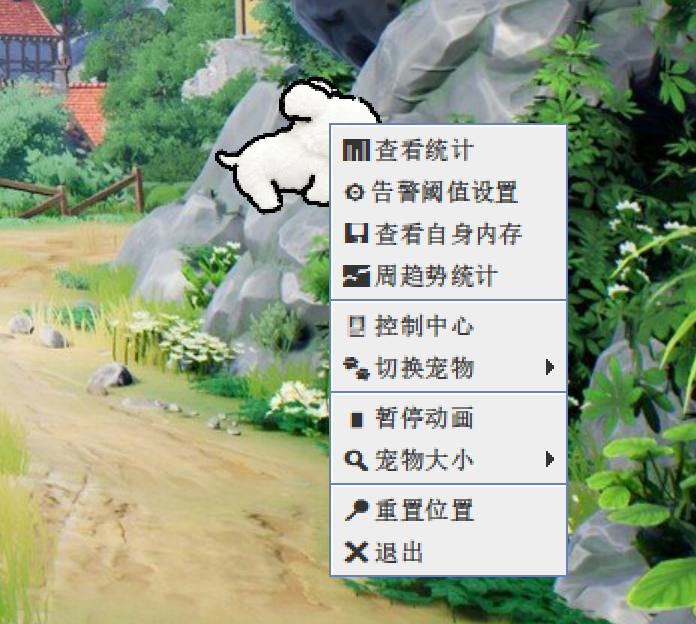

# 🐱 SwingCat - 系统负载可视化桌面宠物

一个用 Java Swing 打造的任务栏宠物，通过奔跑速度让你“看见”电脑的实时负载。

> CPU 越高，猫跑得越快 —— 从此告别看不懂的任务管理器

---

## 📌 项目简介

SwingCat 是一款轻量级桌面工具，将系统资源监控与桌面宠物相结合。用户只需观察右下角宠物的奔跑速度，即可直观感知当前电脑的 CPU 和内存负载状态。

**一句话说清楚**：系统卡不卡，看猫跑得快不快。

---

## ✨ 功能特性

| 功能 | 说明 |
|------|------|
| 💻 实时监控 | CPU、内存使用率实时显示 |
| 🐾 动画联动 | CPU 越高，宠物跑得越快（4档速度） |
| 🪟 透明窗口 | 背景透明，不遮挡任何内容 |
| 📌 任务栏吸附 | 自动定位在屏幕右下角 |
| 🖱️ 鼠标悬停 | 悬停显示实时数据 + 速度等级 + 建议 |
| 🖥️ 控制中心 | 仪表盘 + 历史统计 + 告警设置 |
| 🔔 智能告警 | CPU/内存超阈值时弹窗提醒 |
| 🐕 多宠物 | 支持猫、狗切换 |
| 📏 自定义大小 | 9种尺寸可选（48px ~ 256px） |
| 💾 历史存储 | SQLite 本地存储，支持今日/周统计 |

---

## 🖼️ 运行截图

### 宠物主界面


### 鼠标悬停悬浮窗



### 右键菜单



### 控制中心


> 💡 截图更新中，敬请期待

---

## 🚀 快速开始

### 环境要求
- JDK 21 或更高版本
- 支持 Windows / macOS / Linux

### 方式一：下载 JAR 直接运行（推荐）

1. 前往 [Releases](https://github.com/你的用户名/SwingCat/releases) 下载 `SwingCat.jar`
2. 双击运行即可

### 方式二：从源码运行

```bash
# 克隆项目
git clone https://github.com/你的用户名/SwingCat.git
cd SwingCat

# 编译运行
javac -d out src/main/java/com/runcat/*.java
java -cp out com.runcat.SwingCat
```

### 方式三：在 IDEA 中运行

1. 用 IntelliJ IDEA 打开项目
2. 找到 `src/main/java/com/runcat/SwingCat.java`
3. 右键 → `Run 'SwingCat.main()'`

---

## 🎮 操作指南

| 操作 | 效果 |
|------|------|
| 鼠标悬停 | 显示 CPU/内存 + 速度等级 + 建议 |
| 左键拖拽 | 移动宠物位置 |
| 右键点击 | 弹出功能菜单 |
| 双击左键 | 打开控制中心 |
| 右键 → 切换宠物 | 猫/狗自由切换 |
| 右键 → 大小 | 9种尺寸可调 |
| 右键 → 暂停动画 | 暂停/恢复奔跑 |

---

## 📁 项目结构

```
SwingCat/
├── src/main/java/com/runcat/
│   └── SwingCat.java          # 主程序
├── src/main/resources/images/
│   ├── cat/                   # 猫图片
│   └── dog/                   # 狗图片
├── pom.xml                    # Maven 配置
├── README.md                  # 项目说明
└── LICENSE                    # MIT 许可证
```

---

## 🛠️ 技术栈

| 技术 | 用途 |
|------|------|
| Java 21 | 开发语言 |
| Swing | GUI 框架 |
| JMX | 系统监控 |
| SQLite | 本地数据存储 |
| Maven | 构建工具 |

---

## 📦 打包成 EXE

项目支持打包为 Windows 可执行文件：

1. `mvn clean package` 生成 JAR
2. 使用 exe4j 或 Launch4j 转换为 EXE

---

## 🤝 贡献

欢迎提交 Issue 和 Pull Request！

1. Fork 本仓库
2. 创建分支 (`git checkout -b feature/xxx`)
3. 提交修改 (`git commit -m 'Add xxx'`)
4. 推送分支 (`git push origin feature/xxx`)
5. 提交 Pull Request

---

## 📄 许可证

MIT License © 2026

---

**⭐ 如果这个项目对你有帮助，欢迎 Star！**
